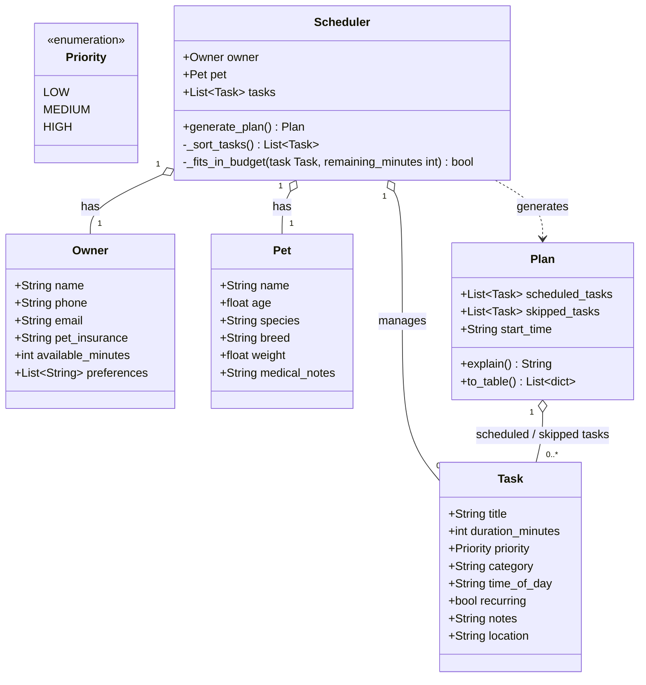

# PawPal+ — UML Class Diagram

> Render this diagram with any Mermaid-compatible viewer
> (e.g., the VS Code "Markdown Preview Mermaid Support" extension).

---

## Class Descriptions

### `Owner`
Represents the pet owner who defines the time budget and preferences for the day.

| Attribute | Type | Required | Notes |
|---|---|---|---|
| `name` | `str` | Yes | Must be non-empty |
| `phone` | `str` | No | Useful for vet contacts |
| `email` | `str` | No | |
| `pet_insurance` | `str` | No | Provider name or yes/no |
| `available_minutes` | `int` | Yes | Converted from `available_hours` in UI; must be ≥ 0 |
| `preferences` | `list[str]` | No | e.g., `["prefers morning tasks"]` |

---

### `Pet`
Holds all relevant information about the pet being cared for.

| Attribute | Type | Required | Notes |
|---|---|---|---|
| `name` | `str` | Yes | Must be non-empty |
| `age` | `float` | Yes | In years; 0 is valid (puppy/kitten) |
| `species` | `str` | Yes | `"dog"`, `"cat"`, or `"other"` |
| `breed` | `str` | No | Affects activity context |
| `weight` | `float` | No | Affects feeding/medication context |
| `medical_notes` | `str` | No | e.g., `"diabetic"`, `"on heart meds"` |

---

### `Priority` *(Enumeration)*
Internal enum used for priority sorting.

| Member | Internal Value |
|---|---|
| `LOW` | `1` |
| `MEDIUM` | `2` |
| `HIGH` | `3` |

> Medication tasks should be forced to `HIGH` regardless of user input, or at least warned.

---

### `Task`
A single pet care activity to be considered for scheduling.

| Attribute | Type | Required | Notes |
|---|---|---|---|
| `title` | `str` | Yes | e.g., `"Morning walk"` |
| `duration_minutes` | `int` | Yes | Range: 1–240 |
| `priority` | `Priority` | Yes | `LOW`, `MEDIUM`, or `HIGH` |
| `category` | `str` | No | `"feeding"`, `"exercise"`, `"medication"`, `"grooming"`, `"enrichment"`, `"vet"`, `"other"` |
| `time_of_day` | `str` | No | `"morning"`, `"afternoon"`, `"evening"`, `"anytime"` — preference only, not a hard constraint |
| `recurring` | `bool` | No | Whether this is a daily task |
| `notes` | `str` | No | Special instructions |
| `location` | `str` | No | Where the task takes place, e.g., `"park"`, `"home"`, `"vet clinic"` |

---

### `Scheduler`
Core business logic. Accepts owner, pet, and task list; produces a `Plan`.

| Member | Type | Visibility | Notes |
|---|---|---|---|
| `owner` | `Owner` | public | |
| `pet` | `Pet` | public | |
| `tasks` | `list[Task]` | public | Input task list |
| `generate_plan()` | `→ Plan` | public | Entry point; runs full scheduling algorithm |
| `_sort_tasks()` | `→ list[Task]` | private | Sort by priority (HIGH→LOW), then duration (shorter first), then FIFO for ties |
| `_fits_in_budget(task, remaining_minutes)` | `→ bool` | private | Returns `True` if `task.duration_minutes ≤ remaining_minutes` |

**Algorithm (greedy):**
1. Convert `owner.available_minutes` to the time budget.
2. Call `_sort_tasks()` to order tasks.
3. Iterate: if `_fits_in_budget(task, remaining)` → add to `scheduled_tasks`, subtract duration; otherwise → add to `skipped_tasks`.
4. Flag any `HIGH` priority tasks that were skipped.
5. Return a `Plan`.

---

### `Plan`
The output of the scheduler. Holds results and provides display/explanation methods.

| Member | Type | Visibility | Notes |
|---|---|---|---|
| `scheduled_tasks` | `list[Task]` | public | Tasks that fit within the budget |
| `skipped_tasks` | `list[Task]` | public | Tasks that were excluded |
| `start_time` | `str` | public | Optional; default `"08:00"` |
| `explain()` | `→ str` | public | Human-readable summary of what was scheduled and why tasks were skipped |
| `to_table()` | `→ list[dict]` | public | Formatted for `st.table()` / `st.dataframe()` |

---

## Relationship Summary

| Relationship | Type | Multiplicity | Description |
|---|---|---|---|
| `Scheduler` → `Owner` | Aggregation | 1 : 1 | Scheduler holds one Owner |
| `Scheduler` → `Pet` | Aggregation | 1 : 1 | Scheduler holds one Pet |
| `Scheduler` → `Task` | Aggregation | 1 : 0..* | Scheduler manages a list of Tasks |
| `Scheduler` → `Plan` | Dependency | 1 : 1 | Scheduler creates (but does not own) a Plan |
| `Plan` → `Task` | Aggregation | 1 : 0..* | Plan holds references to scheduled and skipped Tasks |

> **Aggregation** (hollow diamond) is used because Tasks, Owner, and Pet exist independently
> and are passed into their containers — not created or owned by them.
> **Dependency** (dashed arrow) is used for `Scheduler → Plan` because `Scheduler` creates
> a `Plan` and returns it, but does not hold a long-term reference to it.
